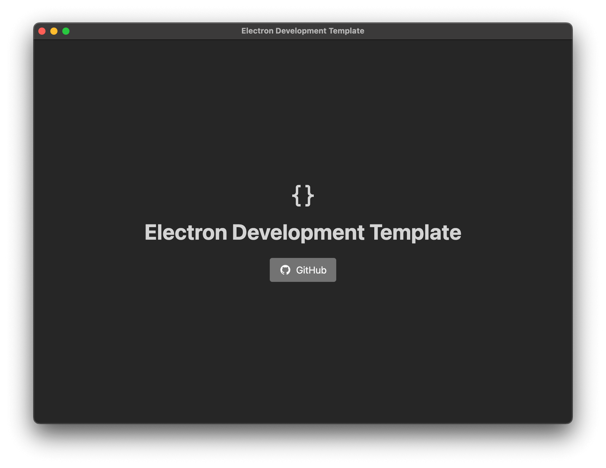

# Electron Development Template

Template to develop GUI applications based on Electron.



# Releases

You can find the latest releases [here](https://github.com/CFIS-UFRO/electron-development-template/releases).

## Mac Security Warning

When first opening the app on macOS, you may see a security warning. To resolve this:

1. Open Terminal
2. Run: `xattr -d com.apple.quarantine /path/to/app.app`
   - Or type `xattr -d com.apple.quarantine ` and drag the app into Terminal

This removes the quarantine flag that blocks unidentified developer apps.

# Origin of this Template

Developing applications with graphical user interfaces (GUIs) is a common task in our laboratory, often needed for hardware control and data analysis projects.

To make these developments easier and more consistent, we developed standard project templates. This repository contains the template designed for building GUI applications using Electron and web technologies.

For those who prefer or require Python for their GUI applications, we also provide a specific template based on Python and Qt, available at: https://github.com/CFIS-UFRO/python-qt-development-template.

# When to Choose This Template

This template is a good choice for projects that require a graphical interface with significant visual customization, needing specific designs or detailed control beyond standard components. It is also well-suited when the application needs to be distributed outside the lab as an easy-to-install executable for end-users.

**Advantages and Considerations**

The main advantages of this template are the **flexibility in visual design** provided by HTML/CSS and the ability to generate **self-contained executables**, simplifying distribution.

However, it's important to note that this involves working with web technologies (JavaScript, HTML, CSS) and related frameworks. If the development team's experience is primarily in other languages, the **initial learning curve might be steeper** compared to more traditional environments used in scientific fields.

**Alternative for Simpler Projects or Internal Use**

If the project requires a simpler interface, is intended primarily for internal lab use, or if the development team prefers to work with languages and frameworks more commonly used in scientific areas, the template based on Python and Qt is a recommended alternative: 
https://github.com/CFIS-UFRO/python-qt-development-template.

# What is Electron?

Electron is a framework for building cross-platform desktop applications with web technologies (HTML, CSS, JavaScript). It combines Chromium for rendering and Node.js for backend capabilities, enabling native desktop apps that run on Windows, macOS, and Linux. This makes it ideal for creating powerful applications with modern web interfaces and native system access.

## Why Electron?

Electron simplifies building desktop applications using web technologies. Its key strengths are:

* **Attractive and Functional User Interfaces:** Allows to create interfaces using HTML, CSS, and JavaScript. Ideal for applications with detailed graphics or interactive elements with a modern look and feel.
* **Simple Distribution:** Packages the application as a single executable file. Users can run it directly without installing additional components or worrying about dependencies.
* **Cross-Platform:** Allows the application to look and function similarly across Windows, macOS, and Linux.
* **Good UI Performance:** It's designed to handle interfaces with high graphics requirements and frequent updates efficiently, keeping the application smooth and responsive.

These features make Electron a practical and powerful option for creating modern, cross-platform desktop applications.

# Repository Structure

Key repository directories:

```
/
├── src/                     # Application source code
│   ├── main/                # Main process (Electron backend)
│   ├── preload/             # Preload scripts (communication bridge)
│   └── renderer/            # Renderer process (Svelte frontend)
├── resources/               # Application resources
├── package.json             # Project dependencies and scripts
└── README.md                # Project documentation
```

# Getting Started

1. Make sure you have [Node.js](https://nodejs.org/) (v18+) and [Git](https://git-scm.com/) installed.
2. Generate a new repository from this template through GitHub:
   - Click "Use this template" -> "Create a new repository"
   - Or manually clone/download the template
3. Clone your new repository locally
4. Set up your application icon:
   - Place a PNG image file in the `resources` folder
   - Name it `icon.png` (must be PNG format)
5. Configure application details in `package.json`:

```json
{
   "name": "your-app-name",                 // Lowercase with hyphens only
   "productName": "Your Application Name",  // Display name
   "description": "Brief description",      // What your app does
   "author": "Name <email@domain.com>",     // Your contact info (multiple authors can be added separated by comma)
   "version": "YYYY.MM.DD.0",               // Version of the app, auto-updated by the publish script
   "port": 3000,                            // Port for the app API
   "repository": "https://github.com/username/repo",         // Your code repository
   "versions_repository": "https://github.com/username/repo" // For updates checking, can be the same as repository
}
```

6. Update application identifiers in `electron-builder.yml`:

```yaml
appId: com.yourdomain.appname      # Unique app identifier, example: com.github.myusername.myapp
```

7. For private repositories:
   - Open `.github/workflows/release.yml`
   - Remove `ubuntu-24.04-arm` from the build matrix (not supported for private repos)

8. Set up development environment:
   ```bash
   npm install    # Install dependencies
   npm run dev    # Start in development mode with hot reload
   ```

9. For production testing:
   ```bash
   npm run start # Start the app in production mode
   ```

10. Optional: If using a versions repository:
    - Create a `.env` file in the project root
    - Add a GitHub token with read and write access to the versions repository:
      ```bash
      GITHUB_TOKEN=your_github_personal_access_token
      ```

# Building and Publishing

## Build Process

Build the application for different platforms using these commands:

```bash
npm run build:mac     # macOS build
npm run build:win     # Windows build  
npm run build:linux   # Linux build
```

For best results, build for your own platform. 

## GitHub Release Publishing

The template includes automated releases via GitHub Actions.

When you push a tag starting with `v`, GitHub Actions automatically:
1. Builds the app for all platforms
2. Creates a GitHub release
3. Uploads build artifacts

### Using the Publish Script

Run the automated publish process with:

```bash
npm run publish
```

This script:
1. Updates version in `package.json` (format: `YYYY.MM.DD.X`)
2. Creates a Git tag
3. Pushes to GitHub
4. Updates the versions repository
5. Triggers the build workflow

### Publishing Requirements

1. GitHub-hosted repository
2. Configured `repository` field in `package.json`
3. Optional: Set `versions_repository` for version tracking
4. If version tracking is enabled add a GitHub token with read and write access to the versions repository:
   ```
   GITHUB_TOKEN=your_github_personal_access_token
   ```

# Template Features

## Application icon

To set your application icon:

1. Place a PNG file named `icon.png` in the `resources` folder
2. The icon will be used when building the application
3. During development, the default Electron icon will be shown

**Note:** The icon must be in PNG format.

## Update Checking

The template includes an automatic update checking system that works as follows:

1. When the application starts, it connects to the versions repository specified in `package.json` (if not null)
2. It checks if a newer version is available by comparing the current version with the latest release
3. If an update is available, a popup notification appears informing the user
4. The popup provides a link that redirects the user to the GitHub releases page

**Note:** The update system currently provides notification-only functionality. When a new version is detected, users will be notified and directed to manually download and install from the releases page. Automatic background updates are not supported.

To disable update checking, set the `versions_repository` or `repository` field in `package.json` to `null`.

## Logging System

The template includes a pre-configured logging system using `electron-log`:

- **Main Process**: 
  ```javascript
  import log from 'electron-log';
  
  log.info('Server message');
  log.error('Something went wrong');
  ```

- **Renderer Process**:
  ```javascript
   import log from 'electron-log/renderer';
   log.info('Log from the renderer process');
  ```

Logs are automatically saved to:
- Windows: `%USERPROFILE%\AppData\Roaming\[app name]\logs\`
- macOS: `~/Library/Logs/[app name]/`
- Linux: `~/.config/[app name]/logs/`

## Internationalization (i18n)

This template uses two different internationalization strategies:
- **Main Process**: i18next
- **Renderer Process**: svelte-i18n

### Main Process Localization

The main process uses i18next for translations.

```javascript
import { t } from 'i18next';

// Usage example
const translatedText = t('key');
```

Translation files are located in:
```
src/main/assets/locales/
```

### Renderer Process Localization

The renderer process uses svelte-i18n for translations.

```javascript
import { _ } from 'svelte-i18n';

// Usage in .js files
const translatedText = get(_)('key');

// Usage in .svelte files
<p>{$_('key')}</p>
```

Translation files are located in:
```
src/renderer/src/assets/locales/
```

### Adding New Languages

To add support for new languages, simply add new JSON files to the appropriate locales directories. Each language should have its own file with the language code as the filename (e.g., `fr.json`, `de.json`).

## Theme 

The template includes built-in theme support with three options:

- Light theme
- Dark theme
- System theme (follows the user's operating system preference)

## Style

This template uses Tailwind CSS for styling components, with built-in dark mode support.

### Usage

Tailwind classes are applied directly to HTML elements:

```html
<!-- Basic styling -->
<div class="text-center p-4 rounded-lg">
  <h1 class="text-4xl font-bold">Heading</h1>
</div>

<!-- Dark mode support -->
<div class="bg-white dark:bg-gray-800 text-black dark:text-white">
  Dark mode compatible content
</div>
```

### Dark Mode

The `dark:` prefix creates styles that only apply when dark mode is active:

```html
<!-- Text that changes color in dark mode -->
<p class="text-neutral-800 dark:text-neutral-300">
  This text is dark in light mode and light in dark mode
</p>

<!-- Buttons with dark mode styling -->
<button class="bg-neutral-200 hover:bg-neutral-300 dark:bg-neutral-700 dark:hover:bg-neutral-600">
  Adaptive Button
</button>

<!-- Borders that change in dark mode -->
<div class="border border-gray-200 dark:border-gray-700">
  Container with adaptive border
</div>
```


## Icons

This template uses Iconify for icon management, providing access to thousands of icons from different collections.

### Usage

In your Svelte components:

```javascript
<script>
  import Icon from '@iconify/svelte';
  import codeBraces from '@iconify/icons-mdi/code-braces';
  import github from '@iconify/icons-mdi/github';
</script>

<!-- Basic usage -->
<Icon icon={codeBraces} class="w-8 h-8" />

<!-- With styling -->
<Icon 
  icon={github} 
  class="text-neutral-700 dark:text-neutral-300" 
  width="20" 
  height="20" 
/>
```

## Main Window Menu

The application features a comprehensive menu system organized into logical categories for easy navigation:

- **File**:
  - Open logs folder
  - Open user preferences folder
  - Open cache folder
  - Check for updates (only if versions repository and main repository are defined)
  - Quit application
  
- **Edit**:
  - Standard editing operations (Undo, Redo)
  - Clipboard functions (Cut, Copy, Paste, Delete)
  - Text selection (Select All)
  
- **View**:
  - Window refresh options (Reload, Force Reload)
  - Developer Tools toggle
  - Zoom controls (Reset Zoom, Zoom In, Zoom Out)
  - Fullscreen toggle
  
- **Settings**:
  - Language selection
  - Theme options (Light, Dark, System)
  
- **About**:
  - Open repository link (only if main repository is defined)
  - Open releases page (only if main repository is defined)
  - View author information
  - Application information

## API

If you configure a port in the `package.json` file, the application will start an API server on that port.

This template uses by default the port 9826 and exposes thw following two test endpoints:

- `GET /info`: Returns a JSON object with the application name:
    ```json
    {
      "appName": "electron-development-template"
    }
    ```

You can test the API by running the application and accessing to `http://localhost:9826/api`.

You can expose more endpoints by modifying the `src/main/api-server.js` file.

# A brief note about Electron architecture

A critical aspect of Electron development is understanding the separation between **Main process** and **Renderer process**:

- **Main Process**: Runs Node.js and has full access to the operating system
- **Renderer Process**: Runs web content in Chromium and has limited system access
- **Preload Scripts**: Create a secure bridge between the two processes

This separation is crucial for security. Direct communication between processes is not allowed; instead, a bridge must be established through preload scripts using Electron's IPC (Inter-Process Communication) system.

This template already includes a configured `preload` script that establishes a secure bridge between processes. The preload exposes a limited API via `contextBridge` that allows the renderer process to access specific IPC functions without exposing the entire Node.js environment.

While the preload script is already configured, you still need to implement the appropriate IPC listeners and emitters in both the main and renderer processes to enable communication. The following patterns demonstrate how to establish these communication channels.

## IPC Communication Patterns

### Main → Renderer (One-way)

When the Main process needs to notify the Renderer without expecting a response:

**Main Process**:
```javascript
// Send data to the main window
BrowserWindow.getAllWindows()[0].webContents.send('theme-changed', lang);
// or
mainWindow.webContents.send('theme-changed', lang);
```

**Renderer Process**:
```javascript
// Set up listener in renderer
window.electron.ipcRenderer.on('theme-changed', (event, theme) => {
    document.documentElement.setAttribute('class', theme);
});
```

### Renderer → Main (With Synchronous Response)

When the Renderer needs immediate data from the Main process:

**Renderer Process**:
```javascript
// Synchronous request - blocks until response is received
const currentTheme = window.electron.ipcRenderer.sendSync('get-theme');
```

**Main Process**:
```javascript
// Synchronous handler with immediate response
ipcMain.on('get-theme', (event) => {
    event.returnValue = getEffectiveTheme();
});
```

### Renderer → Main (One-way, No Response)

When the Renderer sends data to the Main process without expecting a response:

**Renderer Process**:
```javascript
// Send data to main process
window.electron.ipcRenderer.send('log-action', {
    action: 'settings-changed',
    timestamp: Date.now()
});
```

**Main Process**:
```javascript
// Handle received data
ipcMain.on('log-action', (event, actionData) => {
    logger.info('Action logged:', actionData);
});
```

### Renderer → Main (With Asynchronous Response)

For non-blocking requests with response callbacks:

**Renderer Process**:
```javascript
// Send request
window.electron.ipcRenderer.send('get-user-data');

// Listen for response
window.electron.ipcRenderer.on('user-data-response', (event, data) => {
    updateUserInterface(data);
});
```

**Main Process**:
```javascript
// Handle request and send response
ipcMain.on('get-user-data', (event) => {
    const userData = getUserData();
    event.sender.send('user-data-response', userData);
});
```

